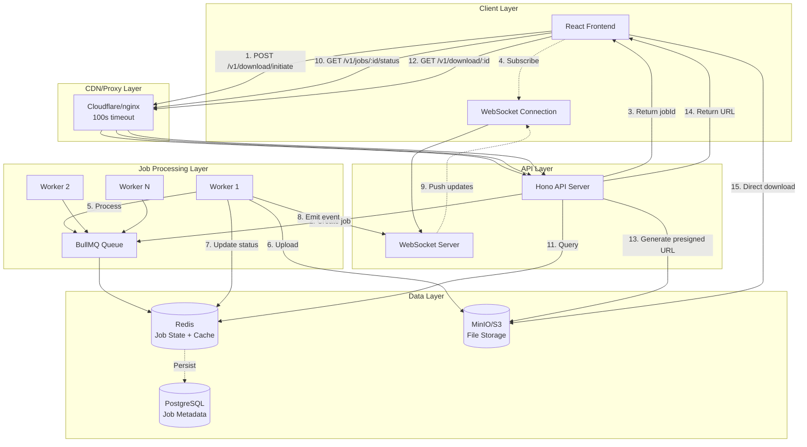

# Long-Running Download Architecture Design

## Executive Summary

This document outlines a production-ready architecture for handling long-running file downloads (10-120+ seconds) in a distributed system behind reverse proxies (Cloudflare, nginx, AWS ALB). The solution uses a **Hybrid Architecture** combining polling, WebSocket real-time updates, and background job processing to provide excellent UX while maintaining scalability and reliability.

**Key Design Points:**

- ✅ Handles proxy timeouts gracefully (Cloudflare 100s limit)
- ✅ Provides real-time progress updates
- ✅ Scales horizontally with Redis-backed queues
- ✅ Supports client disconnection/reconnection
- ✅ Production-ready error handling and retry logic

---

## 1. System Architecture

### High-Level Architecture Diagram



### Data Flow: Fast vs Slow Downloads

#### Fast Download (~10-15s)

```
Client                API                Queue              Worker             S3
  │                    │                   │                  │                 │
  ├─ POST /initiate ──>│                   │                  │                 │
  │<── jobId ──────────┤                   │                  │                 │
  │                    ├─ enqueue ───────>│                  │                 │
  │                    │                   ├─ dequeue ──────>│                 │
  │                    │                   │                  ├─ process ─────>│
  ├─ GET /status ─────>│                   │                  │                 │
  │<── processing ─────┤                   │                  │                 │
  │                    │                   │<── complete ─────┤                 │
  ├─ GET /status ─────>│                   │                  │                 │
  │<── completed ──────┤                   │                  │                 │
  ├─ GET /download ───>│                   │                  │                 │
  │<── presigned URL ──┤                   │                  │                 │
  ├─ Direct download ─────────────────────────────────────────────────────────>│
```

#### Slow Download (~60-120s) with WebSocket

```
Client                API                Queue              Worker             S3
  │                    │                   │                  │                 │
  ├─ POST /initiate ──>│                   │                  │                 │
  │<── jobId ──────────┤                   │                  │                 │
  ├─ WebSocket connect>│                   │                  │                 │
  │<── connected ──────┤                   │                  │                 │
  │                    ├─ enqueue ───────>│                  │                 │
  │                    │                   ├─ dequeue ──────>│                 │
  │<── progress: 0% ───┤<─────────────────────────────────────┤                 │
  │<── progress: 25% ──┤<─────────────────────────────────────┤                 │
  │<── progress: 50% ──┤<─────────────────────────────────────┤                 │
  │<── progress: 75% ──┤<─────────────────────────────────────┤                 │
  │                    │                   │                  ├─ upload ──────>│
  │<── completed ──────┤<─────────────────────────────────────┤                 │
  ├─ GET /download ───>│                   │                  │                 │
  │<── presigned URL ──┤                   │                  │                 │
  ├─ Direct download ─────────────────────────────────────────────────────────>│
```

---

## 2. Technical Approach: Hybrid Pattern

### Why Hybrid?

| Pattern       | Pros                                                | Cons                                    | Best For           |
| ------------- | --------------------------------------------------- | --------------------------------------- | ------------------ |
| **Polling**   | Simple, works everywhere, no persistent connections | Higher latency, more API calls          | Fast downloads     |
| **WebSocket** | Real-time updates, low latency, great UX            | Requires persistent connection, complex | Slow downloads     |
| **Webhook**   | Decoupled, scalable                                 | Requires public endpoint, hard for SPAs | Backend-to-backend |

**Our Solution:** Combine polling + WebSocket for the best of both worlds.

### Architecture Decision

```typescript
if (estimatedDuration < 30s) {
  // Use simple polling
  pollInterval = 2s
} else {
  // Use WebSocket for real-time updates
  establishWebSocketConnection()
  // Fallback to polling if WebSocket fails
}
```

**Benefits:**

- ✅ Fast downloads use lightweight polling
- ✅ Slow downloads get real-time progress
- ✅ Graceful degradation if WebSocket unavailable
- ✅ Works behind all proxies

---

## 3. API Contract Changes

### New Endpoints

#### POST `/v1/download/initiate`

**Purpose:** Start a download job (queue it for background processing)

**Request:**

```json
{
  "file_ids": [70000, 70001, 70002],
  "webhook_url": "https://example.com/callback" // Optional
}
```

**Response:**

```json
{
  "job_id": "job_cm4x7y8z9",
  "status": "queued",
  "created_at": "2025-12-12T10:00:00Z",
  "estimated_completion": "2025-12-12T10:02:00Z",
  "total_files": 3,
  "websocket_url": "wss://api.example.com/ws/jobs/job_cm4x7y8z9"
}
```

#### GET `/v1/jobs/:jobId/status`

**Purpose:** Poll job status

**Response:**

```json
{
  "job_id": "job_cm4x7y8z9",
  "status": "processing", // queued | processing | completed | failed
  "progress": {
    "current": 2,
    "total": 3,
    "percentage": 66
  },
  "files": [
    {
      "file_id": 70000,
      "status": "completed",
      "size_bytes": 1048576
    },
    {
      "file_id": 70001,
      "status": "processing",
      "size_bytes": null
    },
    {
      "file_id": 70002,
      "status": "queued",
      "size_bytes": null
    }
  ],
  "created_at": "2025-12-12T10:00:00Z",
  "updated_at": "2025-12-12T10:01:30Z",
  "completed_at": null,
  "error": null
}
```

#### GET `/v1/jobs/:jobId/download`

**Purpose:** Get download URL (presigned S3 URL)

**Response:**

```json
{
  "job_id": "job_cm4x7y8z9",
  "download_url": "https://s3.amazonaws.com/...",
  "expires_at": "2025-12-12T11:00:00Z",
  "size_bytes": 3145728,
  "filename": "download_job_cm4x7y8z9.zip"
}
```

#### WS `/ws/jobs/:jobId`

**Purpose:** Real-time job updates

**Server → Client Messages:**

```json
{
  "type": "status_update",
  "job_id": "job_cm4x7y8z9",
  "status": "processing",
  "progress": {
    "current": 1,
    "total": 3,
    "percentage": 33
  },
  "timestamp": "2025-12-12T10:01:00Z"
}
```

```json
{
  "type": "completed",
  "job_id": "job_cm4x7y8z9",
  "download_url": "https://s3.amazonaws.com/...",
  "timestamp": "2025-12-12T10:02:00Z"
}
```

```json
{
  "type": "error",
  "job_id": "job_cm4x7y8z9",
  "error": {
    "code": "PROCESSING_FAILED",
    "message": "File 70001 not found"
  },
  "timestamp": "2025-12-12T10:01:30Z"
}
```

### Modified Endpoints

#### POST `/v1/download/check`

**Behavior:** Remains synchronous for single file availability checks (no changes needed)

#### POST `/v1/download/start`

**Deprecation:** This endpoint should be deprecated in favor of `/v1/download/initiate` for production use. Keep for backward compatibility with warning header.

---

## 4. Database & Cache Schema

### Redis Schema (Cache + Queue State)

#### Job Status Cache

```
Key: "job:{jobId}"
Type: Hash
TTL: 7 days
Fields:
  - status: "queued" | "processing" | "completed" | "failed"
  - progress_current: number
  - progress_total: number
  - created_at: timestamp
  - updated_at: timestamp
  - completed_at: timestamp | null
  - error: string | null
  - file_ids: JSON array
  - download_url: string | null
```

#### Job Queue (BullMQ)

```
Queue Name: "downloads"
Priority: 1-10 (higher = more important)
Job Data: {
  job_id: string,
  file_ids: number[],
  user_id: string | null,
  webhook_url: string | null
}
```

#### Active WebSocket Connections

```
Key: "ws:job:{jobId}"
Type: Set
TTL: 1 hour
Members: [connection_id_1, connection_id_2, ...]
```

### PostgreSQL Schema (Persistent Storage)

```sql
CREATE TABLE download_jobs (
  id VARCHAR(50) PRIMARY KEY,
  user_id VARCHAR(50),
  status VARCHAR(20) NOT NULL,
  file_ids JSONB NOT NULL,
  total_files INTEGER NOT NULL,
  completed_files INTEGER DEFAULT 0,
  download_url TEXT,
  webhook_url TEXT,
  error_message TEXT,
  created_at TIMESTAMPTZ NOT NULL DEFAULT NOW(),
  updated_at TIMESTAMPTZ NOT NULL DEFAULT NOW(),
  completed_at TIMESTAMPTZ,
  expires_at TIMESTAMPTZ,
  INDEX idx_user_id (user_id),
  INDEX idx_status (status),
  INDEX idx_created_at (created_at)
);

CREATE TABLE download_job_files (
  id SERIAL PRIMARY KEY,
  job_id VARCHAR(50) REFERENCES download_jobs(id) ON DELETE CASCADE,
  file_id INTEGER NOT NULL,
  status VARCHAR(20) NOT NULL,
  size_bytes BIGINT,
  s3_key VARCHAR(500),
  error_message TEXT,
  created_at TIMESTAMPTZ NOT NULL DEFAULT NOW(),
  completed_at TIMESTAMPTZ,
  INDEX idx_job_id (job_id),
  INDEX idx_file_id (file_id)
);

-- Automatic updated_at trigger
CREATE OR REPLACE FUNCTION update_updated_at_column()
RETURNS TRIGGER AS $$
BEGIN
  NEW.updated_at = NOW();
  RETURN NEW;
END;
$$ language 'plpgsql';

CREATE TRIGGER update_download_jobs_updated_at
BEFORE UPDATE ON download_jobs
FOR EACH ROW EXECUTE FUNCTION update_updated_at_column();
```

---

## 5. Background Job Processing Strategy

### Queue System: BullMQ + Redis

**Why BullMQ?**

- ✅ Built on Redis (high performance)
- ✅ Priority queues
- ✅ Automatic retries with exponential backoff
- ✅ Job scheduling and delays
- ✅ Progress tracking
- ✅ Dead letter queue
- ✅ Horizontal scaling

### Worker Configuration

```typescript
// worker.ts
import { Worker, Job } from "bullmq";

const worker = new Worker(
  "downloads",
  async (job: Job) => {
    const { job_id, file_ids, webhook_url } = job.data;

    try {
      // Update status to processing
      await updateJobStatus(job_id, "processing");

      for (let i = 0; i < file_ids.length; i++) {
        const file_id = file_ids[i];

        // Process file (simulated delay)
        const fileData = await processFile(file_id);

        // Upload to S3
        const s3Key = await uploadToS3(job_id, file_id, fileData);

        // Update progress
        const progress = Math.round(((i + 1) / file_ids.length) * 100);
        await updateJobProgress(job_id, i + 1, file_ids.length);
        await job.updateProgress(progress);

        // Emit WebSocket event
        await emitProgressUpdate(job_id, progress);
      }

      // Create download archive
      const downloadUrl = await createDownloadArchive(job_id, file_ids);

      // Update status to completed
      await updateJobStatus(job_id, "completed", { download_url: downloadUrl });

      // Emit completion event
      await emitCompletionEvent(job_id, downloadUrl);

      // Call webhook if provided
      if (webhook_url) {
        await callWebhook(webhook_url, {
          job_id,
          status: "completed",
          download_url: downloadUrl,
        });
      }

      return { success: true, download_url: downloadUrl };
    } catch (error) {
      // Handle errors
      await updateJobStatus(job_id, "failed", { error: error.message });
      await emitErrorEvent(job_id, error.message);

      if (webhook_url) {
        await callWebhook(webhook_url, {
          job_id,
          status: "failed",
          error: error.message,
        });
      }

      throw error; // BullMQ will handle retries
    }
  },
  {
    connection: redisConnection,
    concurrency: 5, // Process 5 jobs in parallel per worker
    limiter: {
      max: 100, // Max 100 jobs per duration
      duration: 1000, // 1 second
    },
  },
);

// Error handling
worker.on("failed", (job, err) => {
  console.error(`Job ${job.id} failed:`, err);
});

// Progress tracking
worker.on("progress", (job, progress) => {
  console.log(`Job ${job.id} progress: ${progress}%`);
});
```

### Retry Strategy

```typescript
const jobOptions = {
  attempts: 3,
  backoff: {
    type: "exponential",
    delay: 2000, // Start with 2s, then 4s, 8s
  },
  removeOnComplete: {
    age: 86400, // Remove completed jobs after 24 hours
    count: 1000, // Keep max 1000 completed jobs
  },
  removeOnFail: {
    age: 604800, // Keep failed jobs for 7 days
  },
};
```

### Dead Letter Queue

Failed jobs after all retries move to a dead letter queue for manual inspection:

```typescript
const deadLetterWorker = new Worker(
  "downloads:failed",
  async (job) => {
    // Log to monitoring system
    await logToSentry(job.data, job.failedReason);

    // Notify admin
    await notifyAdmin({
      job_id: job.data.job_id,
      reason: job.failedReason,
      attempts: job.attemptsMade,
    });
  },
  { connection: redisConnection },
);
```

---

## 6. Proxy Configuration

### Cloudflare Configuration

**Challenge:** Cloudflare has a 100-second timeout for HTTP requests.

**Solution:** Use our async pattern—API responds immediately with job_id.

```nginx
# Cloudflare Workers (optional edge logic)
addEventListener('fetch', event => {
  event.respondWith(handleRequest(event.request))
})

async function handleRequest(request) {
  const url = new URL(request.url)

  // Allow WebSocket upgrade
  if (request.headers.get('Upgrade') === 'websocket') {
    return fetch(request)
  }

  // Add custom headers
  const modifiedRequest = new Request(request, {
    headers: {
      ...request.headers,
      'X-Forwarded-By': 'cloudflare',
    },
  })

  return fetch(modifiedRequest)
}
```

**Cloudflare Settings:**

- ✅ WebSocket support: Enabled
- ✅ HTTP/2: Enabled
- ✅ SSL/TLS: Full (strict)
- ✅ Always Use HTTPS: Yes

### nginx Configuration

```nginx
upstream api_backend {
    least_conn;
    server api-1:3000 max_fails=3 fail_timeout=30s;
    server api-2:3000 max_fails=3 fail_timeout=30s;
    server api-3:3000 max_fails=3 fail_timeout=30s;
}

upstream ws_backend {
    ip_hash; # Sticky sessions for WebSocket
    server api-1:3000;
    server api-2:3000;
    server api-3:3000;
}

server {
    listen 80;
    server_name api.example.com;

    # API endpoints
    location /v1/ {
        proxy_pass http://api_backend;

        # Timeouts
        proxy_connect_timeout 10s;
        proxy_send_timeout 30s;
        proxy_read_timeout 30s; # Short timeout for async responses

        # Headers
        proxy_set_header Host $host;
        proxy_set_header X-Real-IP $remote_addr;
        proxy_set_header X-Forwarded-For $proxy_add_x_forwarded_for;
        proxy_set_header X-Forwarded-Proto $scheme;

        # Buffering
        proxy_buffering on;
        proxy_buffer_size 4k;
        proxy_buffers 8 4k;
    }

    # WebSocket endpoint
    location /ws/ {
        proxy_pass http://ws_backend;

        # WebSocket upgrade
        proxy_http_version 1.1;
        proxy_set_header Upgrade $http_upgrade;
        proxy_set_header Connection "upgrade";

        # Timeouts (longer for WebSocket)
        proxy_connect_timeout 7d;
        proxy_send_timeout 7d;
        proxy_read_timeout 7d;

        # Headers
        proxy_set_header Host $host;
        proxy_set_header X-Real-IP $remote_addr;
        proxy_set_header X-Forwarded-For $proxy_add_x_forwarded_for;

        # Buffering (disable for WebSocket)
        proxy_buffering off;
    }

    # Rate limiting
    limit_req_zone $binary_remote_addr zone=api_limit:10m rate=100r/m;
    limit_req zone=api_limit burst=20 nodelay;

    # Security headers
    add_header X-Frame-Options "SAMEORIGIN" always;
    add_header X-Content-Type-Options "nosniff" always;
    add_header X-XSS-Protection "1; mode=block" always;
}
```

### AWS Application Load Balancer (ALB)

```yaml
# ALB Configuration (Terraform/CloudFormation)
resource "aws_lb_target_group" "api" {
  name     = "api-target-group"
  port     = 3000
  protocol = "HTTP"
  vpc_id   = aws_vpc.main.id

  health_check {
    path                = "/health"
    healthy_threshold   = 2
    unhealthy_threshold = 3
    timeout             = 5
    interval            = 30
    matcher             = "200"
  }

  # Connection settings
  deregistration_delay = 30

  # Sticky sessions (for WebSocket)
  stickiness {
    type            = "lb_cookie"
    cookie_duration = 86400
    enabled         = true
  }
}

resource "aws_lb_listener" "https" {
  load_balancer_arn = aws_lb.main.arn
  port              = "443"
  protocol          = "HTTPS"
  ssl_policy        = "ELBSecurityPolicy-TLS-1-2-2017-01"
  certificate_arn   = aws_acm_certificate.cert.arn

  default_action {
    type             = "forward"
    target_group_arn = aws_lb_target_group.api.arn
  }
}

# Timeout configuration
resource "aws_lb" "main" {
  # ... other config ...

  # Timeout for idle connections (increase for WebSocket)
  idle_timeout = 3600 # 1 hour
}
```

---

## 7. Frontend Integration (React/Next.js)

### React Hook for Download Management

```typescript
// hooks/useDownloadJob.ts
import { useState, useEffect, useRef } from "react";
import type { JobStatus } from "@/types";

interface UseDownloadJobOptions {
  jobId: string | null;
  useWebSocket?: boolean;
  pollInterval?: number;
}

export function useDownloadJob({
  jobId,
  useWebSocket = true,
  pollInterval = 2000,
}: UseDownloadJobOptions) {
  const [status, setStatus] = useState<JobStatus | null>(null);
  const [error, setError] = useState<Error | null>(null);
  const ws = useRef<WebSocket | null>(null);

  useEffect(() => {
    if (!jobId) return;

    // Determine connection strategy
    const useWS = useWebSocket && typeof WebSocket !== "undefined";

    if (useWS) {
      // WebSocket connection
      const wsUrl = `wss://api.example.com/ws/jobs/${jobId}`;
      ws.current = new WebSocket(wsUrl);

      ws.current.onopen = () => {
        console.log("WebSocket connected");
      };

      ws.current.onmessage = (event) => {
        const data = JSON.parse(event.data);

        if (data.type === "status_update") {
          setStatus((prev) => ({
            ...prev,
            status: data.status,
            progress: data.progress,
          }));
        } else if (data.type === "completed") {
          setStatus((prev) => ({
            ...prev,
            status: "completed",
            download_url: data.download_url,
          }));
        } else if (data.type === "error") {
          setError(new Error(data.error.message));
          setStatus((prev) => ({ ...prev, status: "failed" }));
        }
      };

      ws.current.onerror = (error) => {
        console.error("WebSocket error, falling back to polling", error);
        // Fall back to polling
        startPolling();
      };

      ws.current.onclose = () => {
        console.log("WebSocket closed");
      };

      return () => {
        ws.current?.close();
      };
    } else {
      // Polling fallback
      startPolling();
    }

    function startPolling() {
      const interval = setInterval(async () => {
        try {
          const response = await fetch(`/api/v1/jobs/${jobId}/status`);
          const data = await response.json();
          setStatus(data);

          // Stop polling if completed or failed
          if (data.status === "completed" || data.status === "failed") {
            clearInterval(interval);
          }
        } catch (err) {
          setError(err as Error);
        }
      }, pollInterval);

      return () => clearInterval(interval);
    }
  }, [jobId, useWebSocket, pollInterval]);

  return { status, error };
}
```

### React Component Example

```typescript
// components/DownloadManager.tsx
import { useState } from 'react';
import { useDownloadJob } from '@/hooks/useDownloadJob';

export function DownloadManager() {
  const [jobId, setJobId] = useState<string | null>(null);
  const [fileIds, setFileIds] = useState<number[]>([]);
  const { status, error } = useDownloadJob({ jobId });

  const initiateDownload = async () => {
    try {
      const response = await fetch('/api/v1/download/initiate', {
        method: 'POST',
        headers: { 'Content-Type': 'application/json' },
        body: JSON.stringify({ file_ids: fileIds }),
      });

      const data = await response.json();
      setJobId(data.job_id);
    } catch (err) {
      console.error('Failed to initiate download:', err);
    }
  };

  const downloadFile = async () => {
    if (!jobId || status?.status !== 'completed') return;

    try {
      const response = await fetch(`/api/v1/jobs/${jobId}/download`);
      const data = await response.json();

      // Redirect to S3 presigned URL
      window.location.href = data.download_url;
    } catch (err) {
      console.error('Failed to get download URL:', err);
    }
  };

  return (
    <div className="download-manager">
      <h2>Download Files</h2>

      {!jobId ? (
        <button onClick={initiateDownload}>
          Start Download
        </button>
      ) : (
        <div className="status">
          <p>Status: {status?.status}</p>

          {status?.progress && (
            <div className="progress-bar">
              <div
                className="progress-fill"
                style={{ width: `${status.progress.percentage}%` }}
              />
              <span>
                {status.progress.current} / {status.progress.total} files
              </span>
            </div>
          )}

          {status?.status === 'completed' && (
            <button onClick={downloadFile}>
              Download ({status.files?.length} files)
            </button>
          )}

          {error && (
            <div className="error">
              Error: {error.message}
            </div>
          )}
        </div>
      )}
    </div>
  );
}
```

### Retry Logic

```typescript
// utils/retryFetch.ts
export async function retryFetch(
  url: string,
  options: RequestInit = {},
  maxRetries: number = 3,
): Promise<Response> {
  let lastError: Error;

  for (let i = 0; i < maxRetries; i++) {
    try {
      const response = await fetch(url, options);

      if (response.ok) {
        return response;
      }

      // Retry on 5xx errors
      if (response.status >= 500) {
        throw new Error(`Server error: ${response.status}`);
      }

      // Don't retry on 4xx errors
      return response;
    } catch (error) {
      lastError = error as Error;

      if (i < maxRetries - 1) {
        // Exponential backoff
        const delay = Math.min(1000 * Math.pow(2, i), 10000);
        await new Promise((resolve) => setTimeout(resolve, delay));
      }
    }
  }

  throw lastError!;
}
```

---

## 8. Deployment Strategy

### Infrastructure Requirements

#### Minimum Production Setup

- **API Servers**: 2+ instances (horizontal scaling)
- **Worker Nodes**: 3+ instances (can scale independently)
- **Redis**: 1 primary + 1 replica (Redis Sentinel or Cluster)
- **PostgreSQL**: 1 primary + 1 replica
- **MinIO/S3**: Multi-node distributed setup

#### Recommended Production Setup

- **API Servers**: 3-5 instances behind load balancer
- **Worker Nodes**: 5-10 instances (auto-scaling based on queue depth)
- **Redis**: Cluster mode with 3 primaries + 3 replicas
- **PostgreSQL**: Primary + 2 replicas with connection pooling (PgBouncer)
- **MinIO**: 4+ nodes in distributed mode

### Scaling Considerations

**Horizontal Scaling:**

- ✅ API servers: Stateless, scale based on CPU/memory
- ✅ Workers: Scale based on queue depth (BullMQ metrics)
- ✅ WebSocket: Use Redis pub/sub for multi-instance support

**Auto-Scaling Triggers:**

```yaml
# Kubernetes HPA example
apiVersion: autoscaling/v2
kind: HorizontalPodAutoscaler
metadata:
  name: download-worker
spec:
  scaleTargetRef:
    apiVersion: apps/v1
    kind: Deployment
    name: download-worker
  minReplicas: 3
  maxReplicas: 20
  metrics:
    - type: External
      external:
        metric:
          name: bullmq_queue_waiting_jobs
        target:
          type: AverageValue
          averageValue: "10" # Scale up if >10 jobs per worker
```

### Cost Analysis

#### Small Scale (100 jobs/hour)

- API: 2 × t3.small = $30/month
- Workers: 3 × t3.small = $45/month
- Redis: 1 × t3.micro = $7/month
- PostgreSQL: 1 × t3.small = $30/month
- S3 Storage: 100GB = $2.3/month
- **Total: ~$115/month**

#### Medium Scale (1000 jobs/hour)

- API: 5 × t3.medium = $200/month
- Workers: 10 × t3.small = $150/month
- Redis: 1 × t3.small (cluster) = $30/month
- PostgreSQL: 1 × t3.small + replica = $60/month
- S3 Storage: 1TB = $23/month
- **Total: ~$463/month**

#### Large Scale (10,000 jobs/hour)

- API: 10 × t3.large = $800/month
- Workers: 30 × t3.medium = $1,200/month
- Redis: Cluster with 6 nodes = $150/month
- PostgreSQL: t3.medium + 2 replicas = $300/month
- S3 Storage: 10TB = $230/month
- **Total: ~$2,680/month**

---

## 9. Error Handling & Edge Cases

### Error Scenarios

| Error Case               | Handling Strategy                                |
| ------------------------ | ------------------------------------------------ |
| File not found           | Mark file as failed, continue with other files   |
| S3 upload failure        | Retry with exponential backoff (3 attempts)      |
| Worker crash             | Job returns to queue, another worker picks it up |
| Redis connection lost    | API degrades to synchronous mode with warning    |
| Database unavailable     | Use Redis as temporary storage, sync later       |
| WebSocket disconnect     | Client reconnects and fetches current status     |
| Proxy timeout            | N/A - async pattern prevents this                |
| Concurrent downloads     | Rate limit per user (e.g., 5 concurrent jobs)    |
| Large file memory issues | Stream processing instead of loading to memory   |
| User closes browser      | Job continues in background, can retrieve later  |

### Retry Logic

```typescript
const retryStrategy = {
  maxAttempts: 3,
  backoff: (attemptNumber) => {
    return Math.min(1000 * Math.pow(2, attemptNumber), 10000);
  },
  retryableErrors: [
    "ECONNREFUSED",
    "ETIMEDOUT",
    "ENOTFOUND",
    "S3_UPLOAD_FAILED",
  ],
  nonRetryableErrors: [
    "FILE_NOT_FOUND",
    "INVALID_FILE_ID",
    "PERMISSION_DENIED",
  ],
};
```

---

## 10. Monitoring & Observability

### Key Metrics to Track

**Queue Metrics:**

- Queue depth (waiting jobs)
- Processing rate (jobs/second)
- Average job duration
- Failed job rate

**System Metrics:**

- API response time (p50, p95, p99)
- Worker CPU/memory usage
- Redis memory usage
- Database connection pool utilization
- WebSocket active connections

**Business Metrics:**

- Total downloads per day
- Average download size
- User satisfaction (completion rate)
- Error rate by file type

### Alerts

```yaml
# Prometheus AlertManager rules
groups:
  - name: downloads
    interval: 30s
    rules:
      - alert: HighQueueDepth
        expr: bullmq_queue_waiting > 100
        for: 5m
        annotations:
          summary: "Download queue depth is high"

      - alert: HighFailureRate
        expr: rate(download_jobs_failed_total[5m]) > 0.1
        for: 5m
        annotations:
          summary: "Download failure rate exceeds 10%"

      - alert: WorkerDown
        expr: up{job="download-worker"} == 0
        for: 1m
        annotations:
          summary: "Download worker is down"
```

---

## 11. Security Considerations

### Authentication & Authorization

- ✅ JWT tokens for API authentication
- ✅ Rate limiting per user (prevent abuse)
- ✅ Job ownership verification (users can only access their jobs)
- ✅ Presigned S3 URLs with short expiration (15 minutes)

### Data Privacy

- ✅ Encrypt data in transit (TLS 1.3)
- ✅ Encrypt data at rest (S3 encryption)
- ✅ Auto-delete completed jobs after 7 days
- ✅ GDPR compliance (data deletion API)

### Input Validation

- ✅ Validate file_ids (range, format)
- ✅ Limit job size (max 100 files per job)
- ✅ Sanitize webhook URLs
- ✅ Prevent path traversal in S3 keys

---

## 12. Testing Strategy

### Unit Tests

- Job creation logic
- Status update logic
- Progress calculation
- Error handling

### Integration Tests

- API → Redis → Worker flow
- WebSocket message delivery
- S3 upload/download
- Database persistence

### E2E Tests

- Full download workflow (initiate → process → download)
- WebSocket real-time updates
- Polling fallback mechanism
- Concurrent job processing

### Load Tests

```bash
# Artillery load test
artillery run load-test.yml
```

```yaml
# load-test.yml
config:
  target: "https://api.example.com"
  phases:
    - duration: 300
      arrivalRate: 10
      name: "Sustained load"
scenarios:
  - name: "Download workflow"
    flow:
      - post:
          url: "/v1/download/initiate"
          json:
            file_ids: [70000, 70001]
      - think: 2
      - get:
          url: "/v1/jobs/{{ job_id }}/status"
```

---

## 13. Summary

### Architecture Highlights

✅ **Hybrid Pattern**: Combines polling + WebSocket for optimal UX
✅ **Scalable**: Horizontal scaling of API, workers, and storage
✅ **Resilient**: Automatic retries, dead letter queues, graceful degradation
✅ **Production-Ready**: Comprehensive error handling, monitoring, security
✅ **Cost-Effective**: Pay-per-use model, auto-scaling capabilities

### Implementation Roadmap

1. **Phase 1** (Week 1): Core API changes + BullMQ integration
2. **Phase 2** (Week 2): WebSocket server + Redis pub/sub
3. **Phase 3** (Week 3): Frontend components + testing
4. **Phase 4** (Week 4): Production deployment + monitoring

### Success Criteria

- ✅ Handle 10,000+ concurrent downloads
- ✅ 99.9% job completion rate
- ✅ <100ms API response time (p95)
- ✅ <5s time-to-first-byte for downloads
- ✅ Real-time progress updates (<1s latency)

---

## Appendix

### Technology Stack Summary

- **API Framework**: Hono (ultra-fast, lightweight)
- **Queue**: BullMQ + Redis
- **Database**: PostgreSQL with connection pooling
- **Storage**: MinIO (S3-compatible)
- **WebSocket**: ws library or Socket.IO
- **Monitoring**: Prometheus + Grafana
- **Tracing**: OpenTelemetry + Jaeger
- **Error Tracking**: Sentry

### References

- [BullMQ Documentation](https://docs.bullmq.io/)
- [WebSocket RFC 6455](https://datatracker.ietf.org/doc/html/rfc6455)
- [AWS S3 Presigned URLs](https://docs.aws.amazon.com/AmazonS3/latest/userguide/PresignedUrlUploadObject.html)
- [Cloudflare Workers](https://developers.cloudflare.com/workers/)
- [nginx WebSocket Proxying](https://nginx.org/en/docs/http/websocket.html)
