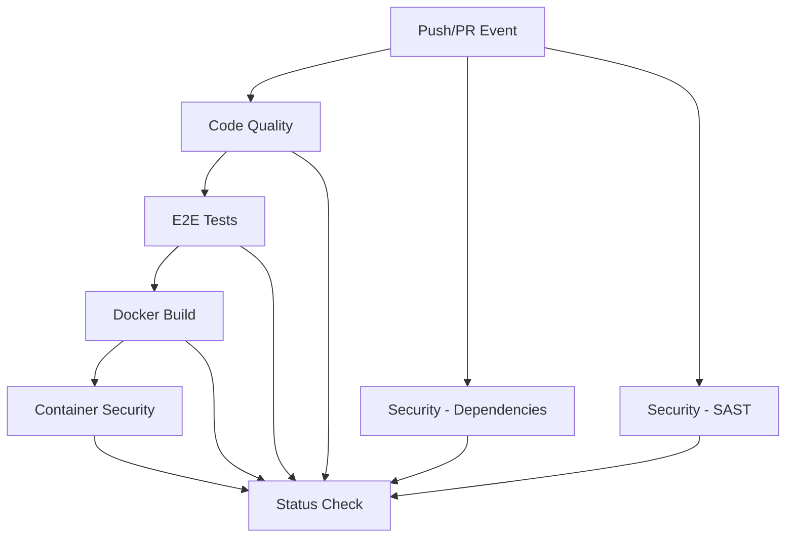

# CI/CD Pipeline Documentation

## Overview

This project uses **GitHub Actions** for continuous integration and continuous deployment (CI/CD). The pipeline automatically runs on every push to `main`/`master` branches and on all pull requests.

## Pipeline Architecture



## Pipeline Stages

### 1. Code Quality

**Runs in parallel** with security scans

- **ESLint**: Checks code style and catches common errors
- **Prettier**: Verifies code formatting consistency
- **Caching**: npm dependencies cached for faster builds

### 2. Security - Dependencies

**Runs in parallel** with code quality

- **npm audit**: Checks for known vulnerabilities in dependencies
- **Snyk**: Advanced security scanning for high/critical vulnerabilities
- **Continue on error**: Won't block deployment but reports issues

### 3. Security - SAST (Static Application Security Testing)

**Runs in parallel** with other jobs

- **CodeQL**: GitHub's semantic code analysis engine
- **Languages**: JavaScript/TypeScript
- **Results**: Uploaded to GitHub Security tab

### 4. E2E Tests

**Requires**: Code Quality to pass

- **Test Suite**: 29 comprehensive end-to-end tests
- **Environment**: Simulated production environment
- **Artifacts**: Test results uploaded (7-day retention)

### 5. Docker Build

**Requires**: E2E Tests to pass

- **Development Image**: Built from `Dockerfile.dev`
- **Production Image**: Built from `Dockerfile.prod`
- **Caching**: GitHub Actions cache for faster builds
- **No Push**: Images built but not pushed (validation only)

### 6. Container Security

**Requires**: Docker Build to complete

- **Trivy**: Vulnerability scanner for container images
- **Severity**: CRITICAL and HIGH vulnerabilities reported
- **Results**: Uploaded to GitHub Security (SARIF format)

### 7. Status Check

**Requires**: All other jobs to complete

- **Critical Jobs**: code-quality, test, docker-build must succeed
- **Security Jobs**: Can fail with warning but won't block
- **Final Gate**: Ensures pipeline integrity

## Running Locally

### Run All Checks Manually

```bash
# Code quality
npm run lint
npm run format:check

# Tests
npm run test:e2e

# Docker build
docker build -f docker/Dockerfile.dev -t test:dev .
docker build -f docker/Dockerfile.prod -t test:prod .
```

### Simulate CI Environment

```bash
# Using act (GitHub Actions local runner)
# Install: https://github.com/nektos/act

# Run all jobs
act

# Run specific job
act -j code-quality
act -j test
```

## Branch Protection Rules

### Recommended Settings

For production repositories, configure these rules in GitHub:

1. **Require status checks to pass before merging**
   - `Code Quality`
   - `E2E Tests`
   - `Docker Build`

2. **Require branches to be up to date before merging**
   - Ensures changes are tested against latest main

3. **Require pull request reviews**
   - At least 1 approval
   - Dismiss stale reviews when new commits are pushed

4. **Require signed commits** (optional)
   - Enhanced security for team projects

### How to Configure

1. Go to repository **Settings** → **Branches**
2. Click **Add rule** for `main` branch
3. Enable the options above
4. Save changes

## Status Badges

Add these badges to your README:

```markdown
[](https://github.com/USERNAME/REPO/actions/workflows/ci.yml)
[](https://github.com/USERNAME/REPO/security/code-scanning)
```

Replace `USERNAME/REPO` with your GitHub username and repository name.

## Security Scanning

### Dependency Scanning (npm audit + Snyk)

**What it checks:**

- Known vulnerabilities in npm packages
- Transitive dependencies
- License compliance issues

**When it runs:**

- Every push and PR
- Can be triggered manually

**How to fix issues:**

```bash
# View audit report
npm audit

# Fix automatically (where possible)
npm audit fix

# Update specific package
npm update package-name
```

### Code Analysis (CodeQL)

**What it checks:**

- SQL injection vulnerabilities
- Cross-site scripting (XSS)
- Path traversal
- Insecure randomness
- And 200+ other vulnerability types

**Results location:**

- GitHub Security tab → Code scanning alerts

### Container Scanning (Trivy)

**What it checks:**

- OS package vulnerabilities
- Application dependencies
- Misconfigurations
- Secrets in images

**How to scan locally:**

```bash
# Build image
docker build -f docker/Dockerfile.prod -t myapp:latest .

# Scan with Trivy
docker run --rm -v /var/run/docker.sock:/var/run/docker.sock \
  aquasec/trivy image myapp:latest
```

## Secrets Management

### Required Secrets

Configure these in **Settings** → **Secrets and variables** → **Actions**:

| Secret       | Purpose                | Required                  |
| ------------ | ---------------------- | ------------------------- |
| `SNYK_TOKEN` | Snyk security scanning | Optional, but recommended |

### Getting a Snyk Token

1. Sign up at [snyk.io](https://snyk.io)
2. Go to Account Settings
3. Copy your API token
4. Add to GitHub repository secrets as `SNYK_TOKEN`

## Troubleshooting

### Pipeline Fails on Lint

```bash
# Run and auto-fix locally
npm run lint:fix
npm run format
git add .
git commit -m "fix: code formatting"
```

### Pipeline Fails on Tests

```bash
# Run tests locally to see detailed output
npm run test:e2e

# Check if services are running
docker compose -f docker/compose.dev.yml up
```

### Docker Build Fails

```bash
# Test build locally
docker build -f docker/Dockerfile.prod -t test:prod .

# Check .dockerignore
cat .dockerignore

# Ensure all dependencies are in package.json
npm install
```

### Security Scan Failures

**npm audit issues:**

- Check if updates are available: `npm outdated`
- Update dependencies: `npm update`
- Force fix: `npm audit fix --force` (use with caution)

**Trivy container issues:**

- Update base image: Change Node.js version in Dockerfile
- Review and update OS packages
- Consider using distroless or alpine images

## Performance Optimization

### Current Optimizations

1. **Dependency Caching**
   - npm packages cached between runs
   - Average time saved: 30-60 seconds per job

2. **Docker Layer Caching**
   - Docker build cache stored in GitHub Actions cache
   - Average time saved: 2-5 minutes per build

3. **Parallel Execution**
   - Code quality and security scans run in parallel
   - Total pipeline time: ~4-6 minutes (vs ~10-15 sequential)

4. **Concurrency Control**
   - Cancels in-progress runs when new commits are pushed
   - Saves action minutes

### Further Optimizations

- **Matrix builds**: Test on multiple Node.js versions
- **Test sharding**: Split E2E tests across multiple runners
- **Conditional execution**: Skip jobs based on changed files

## Monitoring & Metrics

### GitHub Actions Insights

View pipeline metrics:

1. Go to **Actions** tab
2. Click on any workflow
3. View success rate, duration trends

### Recommended Monitoring

- **Pipeline duration**: Should be < 10 minutes
- **Success rate**: Target > 95%
- **Security issues**: Review weekly
- **Dependency updates**: Check monthly

## Contributing

Before submitting a PR:

1. Run all checks locally:

   ```bash
   npm run lint
   npm run format:check
   npm run test:e2e
   ```

2. Ensure Docker builds succeed:

   ```bash
   npm run docker:dev
   ```

3. Review security scan results in PR checks

4. Address any failing checks before requesting review

## Additional Resources

- [GitHub Actions Documentation](https://docs.github.com/en/actions)
- [CodeQL Documentation](https://codeql.github.com/docs/)
- [Trivy Documentation](https://aquasecurity.github.io/trivy/)
- [Snyk Documentation](https://docs.snyk.io/)
